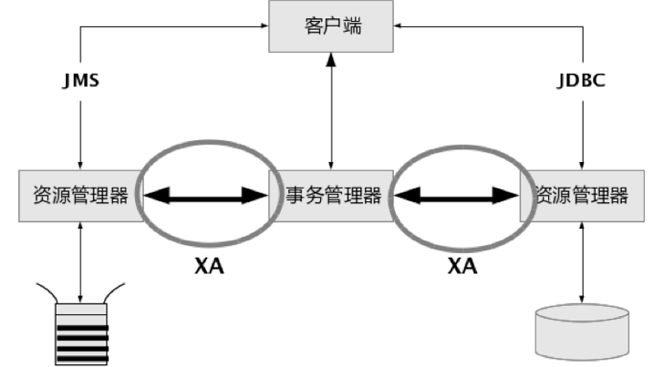
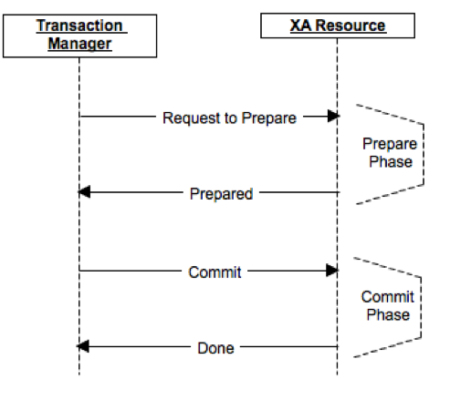

## 事务定义及其特性
### 什么是事务？
> A transaction is a unit of work that you want to treat as "a whole". It has to either happen in full, or not at all.

直接地讲，就是事务是一个整体，其中的若干处理要么都做，要么都不做。接下来我们就详细地聊聊事务。

<!-- more -->

### 事务的ACID特性
事务的四大特性分别为原子性、一致性、隔离性和永久性，称为ACID特性，也称酸性。

1. **原子性（Atomicity）**
  一个事务中所有操作是一个不可分割的操作序列，要么全做，要么全不做。
2. **一致性（Consistency）**
  数据不会因为事务的执行而遭到破坏，一致性保证了这个事务所包含的一系列的操作完成后系统仍然在一个一致的状态，侧重点在于，事务执行前后在某种程度上是等价的，从一个一致状态到另一个一致状态。例如，对银行转帐事务，不管事务成功还是失败，应该保证事务结束后两人存款总额为定值。
3. **隔离性（Isolation）**
  一个事务的执行，不受其他事务（进程）的干扰，既并发执行的个事务之间互不干扰，每个事务都有各自的完整数据空间。
4. **永久性（Durability）**
  一个事务一旦提交，它对数据库所作的改变将是永久的，使发生系统崩溃，重新启动数据库系统后，数据库还能恢复到事务成功结束时的状态。

### 数据库事务管理
对于数据库来说，事务的ACID特性是由关系数据库管理系统（RDBMS，数据库系统）来实现的。

- DBMS采用**日志**来保证事务的原子性、一致性和持久性。
  + 日志记录了事务对数据库所做的更新，如果某个事务在执行过程中发生错误，就可以根据日志撤销事务对数据库已做的更新，使数据库退回到执行事务前的初始状态。
- DBMS采用**锁机制**来实现事务的隔离性。
  + 每个事务对所依赖的资源（如行、页或表）请求不同类型的锁，当多个事务同时更新数据库中相同的数据时，只允许持有锁的事务能更新该数据，其他事务必须等待，直到前一个事务释放了锁，其他事务才有机会更新该数据。锁可以阻止其他事务以某种可能会导致事务请求锁出错的方式修改资源，当事务不再依赖锁定的资源时，它将释放锁。通常会有共享(S)锁、排它(X)锁、更新(U)锁等，各锁的解释、并发效率、锁冲突及其防止办法不在本文范围，有兴趣可以自行了解。
- 除了锁定外，也可能采用**行版本控制**来实现事务隔离性。
  + 当启用了基于行版本控制的隔离级别时，数据库引擎将维护修改的每一行的版本，应用程序可以指定事务使用行版本查看事务或查询开始时存在的数据，而不是使用锁保护所有读取。通过使用行版本控制，读取操作阻止其他事务的可能性将大大降低，锁数量减少，死锁可能性降低，有效减少了管理锁的开销。

锁定和行版本控制可以防止用户读取未提交的数据，还可以防止多个用户尝试同时更改同一数据。如果不进行锁定或行版本控制，对数据执行的查询可能会返回数据库中尚未提交的数据，从而产生意外的结果。

在了解数据库保证事务ACID特性的基本原理后，那么……对程序提供的数据库编程接口，如何实现事务的呢？接下来介绍本地事务。

----

## 本地事务（Local Transaction）

### 基本介绍
本地事务(Local Transaction)主要指限制在单个进程内的事务，不涉及多个数据库源，通常会有Begin Transaction … End Transaction来控制事务的开始与结束。以对数据库访问为例，接下来用伪代码实现事务的提交/回滚。

### 本地事务 模型1
设置自动提交的情况：

```
conn = getConnection(“url","user","pwd");
conn.setAutoCommit(true);
try{
    conn.execute(...);
}
catch(Exception e) {
    print(e);
}
finally {
    conn.close();
}
```
### 本地事务 模型2
设置非自动提交情况：

```
conn = getConnection(“url","user","pwd");
conn.setAutoCommit(false);
try{
    conn.execute(…);
    conn.commit();
}
catch(Exception e) {
    conn.rollback();
}
finally {
    conn.close();
}
```
这也是最早的访问方式，相信你也发现一些问题了，如果设置为自动提交，当某个操作需要多个执行序列完成时，那么每次execute时都会commit，在很程度上降低了执行效率。若设置为非自动提交，虽然解决了多次execute的问题，但直接暴露conn并不是理想的做法，同时还需要手动close连接。因此，有没有更好地方式呢？答案是肯定的，接下来就看看编程式事务的实现方式。

----

## 编程式事务（Programmatic Transaction）

### 基本介绍
编程式事务(Programmatic Transaction)通过编程语言提供的事务API和事务服务提供者进行事务控制。通常的做法是在代码中直接加入处理事务的逻辑，显式地调用其commit()、rollback()等事务管理相关方法。

### 编程式事务 模型
```
userTransaction.begin();
try {
    doSomething();
    doAnotherThing();
    userTransaction.commit();
} catch (Exception ex) {
    userTransaction.rollback();
}
```
### 与Local事务的区别
Programmatic与Local Transaction的区别在于Programmatic把Local方式下的conn封装起来，并且手动控制commit和rollback，在一定程序上简化了编程的繁琐性，更加关注事务开始、提交与回滚。你觉得这种方式就已经很棒了么，再想想还有没有更好更创新的方法呢，声明式事务会给你想要的答案。

----

## 声明式事务（Declarative Transaction）

### 基本介绍
声明式事务(Declarative Transaction)对目标方法上添加注解(Annotation)或在配置文件中定义，通过对方法前后拦截添加事务处理逻辑。虽然XML配置的方式在前几年很受欢迎，也是具有里程碑的意义，但小编我更青睐注解的方式，况且目前主流的IoC框架也都支持注解方式并且推荐使用。接下来将给出Java形式的伪代码进行解释。

### 声明式事务 模型
```
@Transaction
void doSomething() {
    process1();
    process2();
    ……
    repository.save();
}
```
其中的@Transaction就是一个注解(Annotation)，其内部实现原理通常采用的是[AOP(面向切面编程)](/blog/aspect-oriented-programming)的方式进行方法的拦截。
```
Object intercept(proxy, method, args) {
    trans.begin();
    try {
    	method.invoke(target, args);
    	trans.commit();
    } catch (Exception e) {
    	trans.rollback();
    }
}
```

以上所有的事务实现方式都主要集中在单一数据库情况，那么对于多数据库协调或者混合数据源情形，如数据库加消息队列等，又如何保证事务正确有效地执行呢？答案是分布式事务，也称全局事务来管理了。

----

## 全局/分布式事务（Global/Distributed Transaction）

### 基本介绍
全局/分布式事务(Global/Distributed Transaction)也称XA事务，主要处理跨越多个数据库或进程，多资源协调的情形（例如：访问多个数据库，或数据库加消息队列，又或是多个消息队列等）。其中核心概念包括:

- 事务管理器（Transaction Manager）
- 资源管理器（Resource Manager）
- XA协议标准（eXtended Architecture Standard）
- 两阶段提交（Two-Phase Commit）

首先来看一个关于JMS Message触发数据库更新操作的实例。

### JMS触发DB更新的实例

#### DB+JMS 伪代码
```
@JMSListener(...)
void onMessage(...) {
    service.merge(...);
}

@Transaction
void merge(…) {
    ……
    repository.update(…);
    ……
}
```

#### 成功调用过程
> 1. Start messaging transaction
2. **Receive message**
3. Start database transaction
4. **Update database**
5. Commit database transaction
6. Commit messaging transaction

成功调用Happy Pass当然没有什么问题，正常提交到数据库，也完成消息提交，但在实际情况中往往不是所期望的。

#### 可能失败的情形
> 1. Start messaging transaction
2. **Receive message**
3. Start database transaction
4. **Update database, fail!** <--
5. Roll back database transaction
6. Roll back messaging transaction

可以看到第4步更新数据库时由于某种外键或唯一键约束导致数据库更新失败，这时需要回滚数据库操作以及消息提交，而如何保证Database和JMS之间能够正确工作是首要问题。同理，针对多个数据库或多个消息队列(Queue)/主题(Topic)，Transaction是如何协调多资源的呢？

### XA事务多资源协调

#### X/Open XA规范接口

XA协议采用两阶段提交方式来管理分布式事务，XA接口提供资源管理器(RM)与事务管理器(TM)之间进行通信的标准接口。下图来自网络，大致描述了RM和TM的关系以及XA工作范畴，资源管理器管理着多个资源，事务管理器与资源管理器通过XA进行双向通信。


XA事务实现原理主要是针对每一个XA资源给全局事务和本地事务分配一个xid，每一个XA资源都被加入的XA的管理器中，通过某个方法来决定XA资源已经被加入到事务中并且已经准备就绪，最后统一提交，也就是所谓的两阶段提交。

#### XA两阶段提交协议
两阶段提交协议（The two-phase commit protocol，2PC）是XA用于在全局事务中协调多个资源的机制。两阶段提交协议包含了两个阶段：准备阶段(Prepare)和提交阶段(Commit)。准备阶段需要检查资源的状态(READY, READ_ONLY, NOT_READY)，当且仅当所有资源都是READY状态，准备阶段完成，否则进行Rollback操作。下图来自网络，大致描述了2PC的工作流程。



TM可以向RM查询事务的状态，RM必须要返回一系列事务的XID，表明事务是prepared状态，还是已经commit的状态。TM会把XID,已完成的RM等这样的事务信息保存起来的，只有当全部的RM提交或者回滚完后，才能丢弃这些事务的信息。**XA事务都假定了TM和RM都是有牢靠的存储，所以也保证了TM重启后可以从日志里恢复还未处理完的事务。**


TM/RM初始化和XA两阶段提交伪代码如下:
```
// TM/RM Init 伪代码
TransactionManager() {
    xaResourceManager = new XAResourceManager(gtrid);
}

bool enlistResource(xaResource) {
    xaResourceHolder = findXAResourceHolder(xaResource);
    xaResourceHolderState = new XAResourceHolderState(xaResourceHolder);
    xaResourceHolderState.setTransactionTimeoutDate(timeout);
    xaResourceManager.enlist(xaResourceHolderState);
}

////////////////////////////////
// XA 2PC 伪代码
List<XAResourceHolderState> interestedResources;
try {
    interestedResources = preparer.prepare(this); //Get resources and check their states
} catch(RollbackException ex) {
    rollbackPrepareFailure(ex); // If one of the resources is not ready
}
committer.commit(this, interestedResources); // All resources are ready and commit all at once
…… // Other code goes here

////////////////////////////////
// 备注:
// preparer.prepare(this) is to get the resources and check their states
// should call resource manager: transaction.getResourceManager().getAllResources();

```

----

## XA事务问题与优化策略

对于非XA事务，范围仅限于单个可识别数据资源的事务操作。对于XA事务，可能出现timeout问题，连锁反应导致系统变慢，同时XA事务也会消耗更多性能资源。因此，仅在同一个事务上下文中需要协调多种资源时，才有必要使用XA，也就是说仅当多个资源必须在同一个事务范畴内被协调时，才有必要用XA。

针对XA事务可能出现的问题，目前常用的优化策略:
- **最后资源提交优化（Last Resource Commit Optimization）**
  + 最后资源提交优化允许有且仅有一个资源是非XA资源，不必进入到准备阶段而可以直接提交或回滚，如果有这样的一个资源存在XA事务中，那首先应该尝试准备其他XA的资源，然后提交该非XA资源，如果成功，提交其他XA资源，否则回滚所有资源。通常的场景是当如JDBC这样的Driver不支持XA时，可以将其配置成最后参与者(资源)，然后就可以和XA资源进行协作了。
- **一阶段提交优化（One-Phase Commit Optimization）**
  + 如果使用了XA事务，但资源只有一个，为了节省不必要的开销，XA不会执行两阶段提交，准确地说是没有准备阶段，而是当作单个资源处理并直接提交。
- **经验异常（Heuristic Exception）处理**
  + 在两阶段提交的过程，资源管理器可能会使用“经验化决策”的策略，提交或者回滚，而不受事务管理器的控制。“经验化决策”是指根据多种内部和外部因素做出智能决定的过程，当资源管理器这么做了，它会向客户端报上一个经验异常（Heuristic Exception）。在XA环境下，两阶段提交的过程中，特别是事务参与者在第一阶段产生了响应之后，经验异常最常见的原因是第一阶段和第二阶段之间的超时情况，当网络延迟或故障、资源锁定以及资源使用过量时，资源管理器或许要做出提交或回滚其工作的决定，以释放资源。

## 学海无涯 Keep Learning
    1. 可以研究下Java中Spring JTA Transaction Manager, 如Bitronix, Atomikos, etc.
    2. 可以研究下各数据库如何开启和关闭支持XA事务，如何设置同时处于"准备好"状态的事务的最大数目（max_prepared_transactions）.


