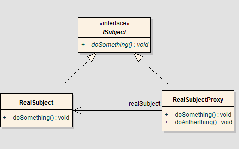

## What is AOP ?
AOP(Aspect Oriented Programming)，即面向切面编程，是一种设计思想，通过预编译方式或运行时动态代理实现为程序统一添加功能的技术。

<!-- more -->

AOP可以理解为OOP(面向对象编程)里程碑式的补充。OOP是从静态角度考虑程序结构，从横向上区分出类，AOP是从动态角度考虑程序运行过程，从纵向上向对象中加入特定的代码，加上时间维度，AOP使得OOP从二维变成三维，由平面变成立体。常常通过AOP来处理一些具有横切性质的系统性服务，如[事务管理](/blog/transactional-mechanism-protocol)、安全检查、缓存、对象池管理等。

通常做法，是在运行时动态地将代码切入到类的指定方法、指定位置上，而切入到指定类指定方法的代码片段称为切面，而切入到哪些类、哪些方法则叫切入点，采用AOP可以把几个类共有的代码抽取到一个切片中，等到需要时再切入对象中去，从而改变其原有的行为。接下来将详解AOP中的几个核心概念。

### AOP核心模块
#### Aspect（切面）
- 日志切面、权限切面、事务切面等

#### Joinpoint（连接点）
- 方法调用、异常抛出等

#### Advice（通知）
- Before/AfterReturning/AfterThrowing/After/Around

#### Pointcut（切入点）

#### Target（目标对象）

#### Proxy（代理对象）
- 对使用者透明，程序运行中间产物

#### Weaving（织入）
- Complie，Classload，Runtime

## How does it wok ?
AOP技术是建立在反射机制与动态代理机制之上的。

业务逻辑组件在运行过程中，动态创建一个代理对象供使用者调用，该代理对象已经将切面成功切入到目标方法的连接点上，从而使切面的功能与业务逻辑的功能同时得以执行。

## Why AOP ?
- 解决业务逻辑共有代码冗余问题
- 只需关心核心的业务逻辑处理，既提高了工作效率，又使代码变更简洁优雅。
- 核心业务逻辑代码与共有代码分离，且共有代码集中存放，使得维护工作更加简单轻松。

## When AOP?
- Authentication 权限检查
- logging / tracing 日志/跟踪
- Transactions 事务处理
- Exception Handling 异常处理
- ……

## AOP in Practice
主要针对AOP在Java中的实现，并解读在Spring中AOP的伪代码实现。

### Proxy DP
首先来回顾一下设计模式中的代理模式:
> 代理模式(Proxy Design Pattern)，为其他对象提供一种代理以控制对这个对象的访问。

也就是如下图所示的关系，代理对象通过调用实际对象的方法来控制对该实际对象的访问。



以下简单给出以Hello类为例的伪代码，通过代理对象调用实际对象的sayHello方法，并且在该方法的实际调用前后增加打印记录行为，模拟了拦截方法的过程。

```
public interface IHello {
    void sayHello(String name);
}

// 实际的类，已有的操作和行为
public class Hello implements IHello {
    @Override
    public void sayHello(String name) {
         println(“Hello "+name);
    }
}

// 代理类，通过调用代理方法访问实际方法并且添加新的职责
class HelloProxy implements IHello {
	private IHello hello = new Hello();

  	@Override
    public void sayHello(String name) {
        println("before...."); // 实际调用前添加新的行为
        hello.sayHello(name);
        println("after...."); // 实际调用后添加新的行为
    }
}

```

### JDK Dynamic Proxy
JDK动态代理方式，使用接口实现：

```
public class DynamicProxyHello implements InvocationHandler {
    private Object target;
    public Object bind(Object target){
        this.target = target;
        return Proxy.newProxyInstance(target.getClass().getClassLoader(),
                                      target.getClass().getInterfaces(), this);
    }

    @Override
    public Object invoke(Object proxy, Method method, Object[] args) {
        do("before..... ");
        Object result = method.invoke(target, args);
        do("after.....");
        return result;
    }
}
```

### CGLib Proxy
CGLIB方式，使用继承实现：

```
MethodInterceptor

Enhancer

MethodProxy

```