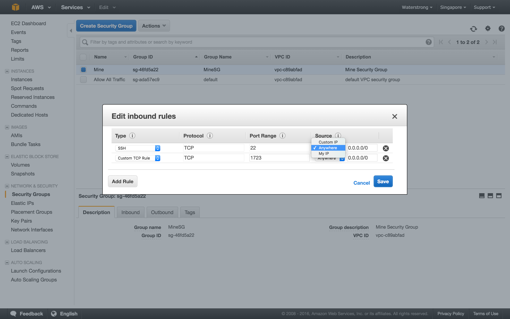

### 基本介绍
#### 什么是Amazon EC2

> Amazon Elastic Compute Cloud (Amazon EC2) provides scalable computing capacity in the Amazon Web Services (AWS) cloud.

Amazon EC2是一个IaaS云服务，主要提供弹性的计算资源，通俗地讲，就是提供多种类型的虚拟机。EC2也是整个AWS最核心的组成部分，AWS中有许多的服务需要依赖它。在EC2环境中，虚拟机被称为实例，实例的镜像被称为AMI(Amazon Machine Image)。使用AWS EC2有如下优势：

- 可避免前期的硬件投入，因此能够快速开发和部署应用程序
- 可根据自身需要快速启动任意数量的虚拟服务器、配置安全和网络以及管理存储
- 允许根据需要进行缩放以应对需求变化或流行高峰，降低流量预测需求
- 主要是根据类型和使用时间收费，即使用多少收多少的费用

#### 相关概念和名词解释

Instance: 实例，在EC2环境中，虚拟计算环境被称为实例。
AMI: Amazon Machine Image，亚马逊系统映像，即实例的预配置模板，其中包含服务器需要的程序包（包括操作系统和其他软件）。

IaaS: Infrastructure as a Service, 基础设施即服务。消费者通过Internet可以从完善的计算机基础设施获得服务，这类服务称为基础设施即服务(IaaS)，基于Internet的服务（如存储和数据库）是IaaS的一部分。

IaaS通常分为三种用法：公有云、私有云和混合云。Amazon EC2在基础设施云中使用公共服务器池(公有云)，更加私有化的服务会使用企业内部数据中心的一组公用或私有服务器池(私有云)，如果在企业数据中心环境中开发软件，那么这两种类型公有云、私有云都能使用(混合云)。

Internet上其他类型的服务包括平台即服务(Platform as a Service, PaaS)和软件即服务(Software as a Service, SaaS)。PaaS提供了用户可以访问的完整或部分的应用程序开发，SaaS则提供了完整的可直接使用的应用程序，比如通过 Internet管理企业资源。

### Instances Management 实例管理
虚拟计算环境，也称为实例
实例的预配置模板，也称为亚马逊系统映像 (AMI)，其中包含您的服务器需要的程序包（包括操作系统和其他软件）。
实例 CPU、内存、存储和网络容量的多种配置，也称为实例类型

### Resource & Tags 资源 & 标签
Amazon EC2提供可创建和使用的不同资源，这些资源中的一部分资源包括映像、实例、卷和快照，在创建某个资源时，该资源会被分配一个唯一资源 ID。可以定义某个值标记某些资源，来帮助组织和识别这些资源，即Tags。

标签(Tag)为了方便管理实例、映像以及其他Amazon EC2资源，可通过标签的形式为每个资源分配元数据(Meta Data)。标签可按各种标准（例如用途、所有者或环境）对AWS资源进行分类，每个标签都包含定义的一个键和一个可选值，例如下图所示：

### Volumes 存储卷

临时数据（停止或终止实例时会删除这些数据）的存储卷，也称为实例存储卷
使用 Amazon Elastic Block Store (Amazon EBS) 的数据的持久性存储卷，也称为 Amazon EBS 卷。

用于存储资源的多个物理位置，例如实例和 Amazon EBS 卷，也称为区域和可用区

Elastic Block Store
卷，硬盘， S3，EBS

df -h
df -T
sudo fdisk -l

sudo mkfs.ext4 /dev/xvdf

sudo mount /dev/xvdf /mnt/ebs

sudo umount /dev/xvdf

### Snapshots 快照
每个快照代表一个卷在一个特定时间点的状态。

### Security Groups 安全组

防火墙，让您可以指定协议、端口，以及能够使用安全组到达您的实例的源 IP 范围

您可以使用安全组来控制您的实例的访问权限。这些安全组类似于一个传入网络防火墙，使您可以指定允许访问您的实例的协议、端口和源 IP 范围。您可以创建多个安全组，并给每个安全组指定不同的规则。然后您可以给每个实例分配一个或多个安全组，我们将按照这些规则确定允许哪些流量可访问实例。您可以配置一个安全组，以便只有特定的 IP 地址或特定的安全组可以访问实例。

### Key Pairs 密钥对

使用密钥对的实例的安全登录信息（AWS 存储公有密钥，您在安全位置存储私有密钥）

### Placement Groups 置放群组

### Elastic IPs 弹性IP
弹性IP地址是专为动态云计算设计的静态IP地址。实例在重启后会自动重新分配一个与原实例不同的公有IP地址，如果应用程序需要一个静态IP地址，可以使用弹性IP地址关联到实例，并且在实例发生故障的情况下能够将该地址映射到另一实例，并能够将 DNS主机名用于所有其他节点间通信，从而屏蔽实例故障。

为确保弹性IP地址的有效使用，如果弹性IP地址未与正在运行的实例关联，或者它已与停止的实例或未连接的网络接口关联，Amazon将强制收取小额的小时费用，每小时是$0.005。当实例正在运行时，无需为与该实例关联的某个弹性IP地址付费。当重新映射弹性IP地址次数一个月内超过了100次将收取$0.10费用。在默认情况下，所有AWS账户最多可拥有5个EIP。

### Network Interfaces 网络接口

您可以创建的虚拟网络，这些网络与其余 AWS 云在逻辑上隔离，并且您可以选择连接到您自己的网络，也称为 Virtual Private Cloud (VPC)

### Load Banlancers 负载均衡

### Dedicated Hosts

### Auto Scaling

当系统提示提供密钥时，选择 Choose an existing key pair，然后选择您在进行设置时创建的密钥对。

另外，您也可以新建密钥对。选择 Create a new key pair，输入密钥对的名称，然后选择 Download Key Pair。这是您保存私有密钥文件的唯一机会，因此务必单击进行下载。将私有密钥文件保存在安全位置。当您启动实例时，您将需要提供密钥对的名称；当您每次连接到实例时，您将需要提供相应的私有密钥。

允许从您的 IP 地址到您的实例的入站 SSH 流量
确保与您的实例关联的安全组允许来自您的 IP 地址的传入 SSH 流量

[Amazon EC2 的设置](http://docs.aws.amazon.com/zh_cn/AWSEC2/latest/UserGuide/get-set-up-for-amazon-ec2.html)
[在 Linux 实例上管理用户账户](http://docs.aws.amazon.com/zh_cn/AWSEC2/latest/UserGuide/managing-users.html)

参考资料
[1] [Amazon EC2 User Guide for Linux Instances](http://docs.aws.amazon.com/AWSEC2/latest/UserGuide/concepts.html)
